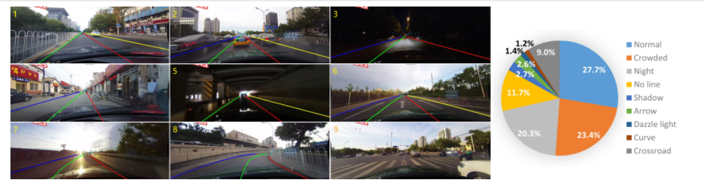
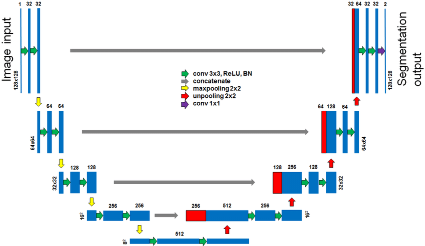
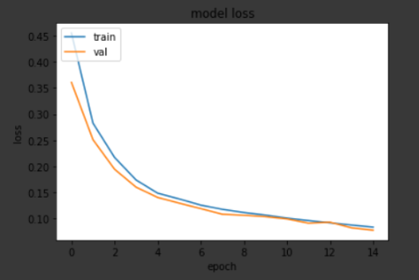
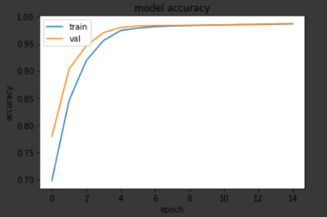
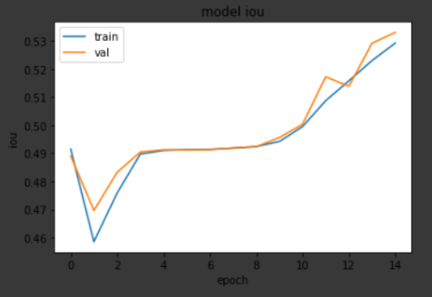

# Lane Segmentation
Lane segmentation done using Tensorflow framework in Python and trained on CU Lane dataset. Model and loss function used are U-Net and dice loss.

## Installation and Setup

* Fork the repo and clone it.
```
https://github.com/Frostday/Lane-Segmentation.git
```
* Install the necessary packages required to run the code
* Download CU Lane dataset and put it inside the data folder
* Run the following command
```
python lane_segmentation.py
```
* If you want to see results from a pretrained model then run the following command
```
python pretrained.py
```

## Dataset

CULane is a large dataset for lane detection collected by cameras mounted on six different vehicles on the streets of Beijing, China. More than 55 hours of videos were collected and 133,235 frames were extracted. These images are not sorted and have a resolution of 1640 x 590 pixels. The dataset is divided into 88,880 image for training, 9,675 for validation and 34,680 images for test. The following
figure provides a breakdown of different driving conditions captured in this dataset. Challenging driving conditions represent more than 72.3\%. Each frame is manually annotated with cubic splices. In case the traffic lanes are occluded by vehicles, the lanes are annotated based on the context. Lanes on the other side of the road are not annotated. Each image has a corresponding annotation text file providing to the x and y coordinates for key lane marking points.

CULane dataset is comprised of two types of images. The first consists of the original images; whereas the second category consists of mask images, which contain only the lane markings based on the original image. In case there are no lane markings, the mask image is empty. Each mask image contains a number representing lane markings from the original image. This number for the mask pixel denotes whether a lane is present on that particular pixel, and it takes 5 possible values. When a mask pixel has zero value of zero, it means a lane is absent. On the other hand, if a mask pixel has a value between 1 and 4, this implies that a lane is present on this pixel and the number denotes the lane number. In short, every mask image may have from 0 to 4 lanes detected, and the lanes are numbered from left to right.

## U-Net Model


## Results
This is the result after 10 epochs

| Loss   | Accuracy | IOU    |
|:-------|:---------|:-------|
| 0.1066 | 0.9840   | 0.4942 |

| Val Loss | Val Accuracy | Val IOU |
|:---------|:-------------|:--------|
| 0.1035   | 0.9843       | 0.4956  |

| Loss                | Accuracy           | IOU                |
|:--------------------|:-------------------|:-------------------|
| | | |

